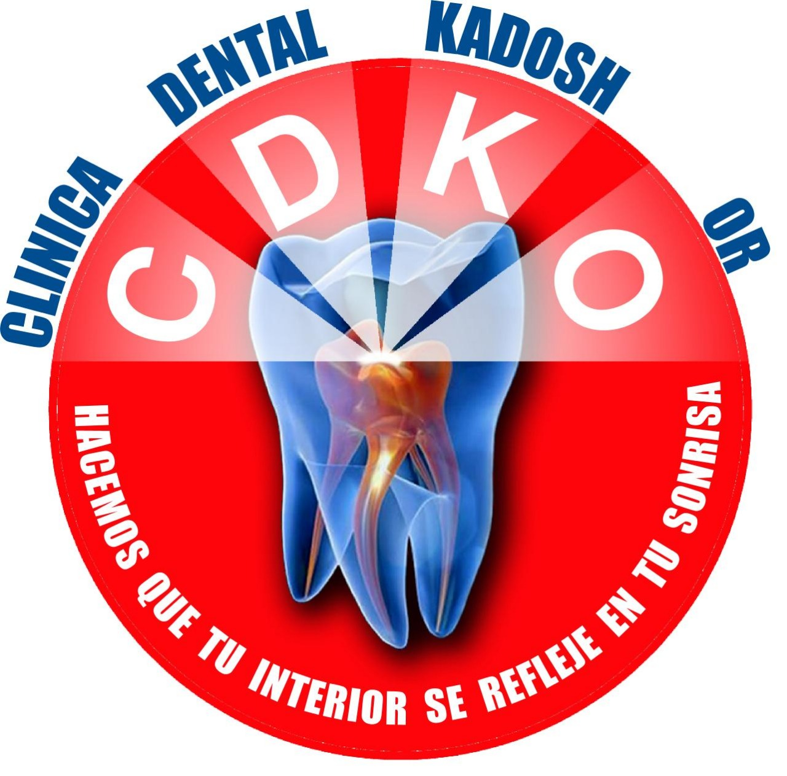

# 🦷 Kadosh - Sistema de Gestión Odontológica

<div align="center">



**Sistema integral de gestión para clínicas odontológicas**

[](https://reactjs.org/)
[](https://laravel.com/)
[](https://www.php.net/)
[](LICENSE)

[Características](#-características) • [Instalación](#-instalación) • [Uso](#-uso) • [Tecnologías](#-tecnologías) • [Contribuir](#-contribuir)

</div>

---

## 📋 Tabla de Contenidos

- [Descripción](#-descripción)
- [Características](#-características)
- [Tecnologías](#-tecnologías)
- [Requisitos del Sistema](#-requisitos-del-sistema)
- [Instalación](#-instalación)
- [Configuración](#-configuración)
- [Uso](#-uso)
- [Estructura del Proyecto](#-estructura-del-proyecto)
- [Módulos Principales](#-módulos-principales)
- [API Documentation](#-api-documentation)
- [Despliegue](#-despliegue)
- [Contribuir](#-contribuir)
- [Licencia](#-licencia)
- [Autor](#-autor)

---

## 🎯 Descripción

**Kadosh** es un sistema completo de gestión diseñado específicamente para clínicas odontológicas. Facilita la administración de pacientes, citas, tratamientos, facturación, inventario y mucho más, todo desde una interfaz moderna e intuitiva.

El sistema está construido con una arquitectura de **frontend y backend separados**, utilizando React para la interfaz de usuario y Laravel para la API y lógica de negocio.

---

## ✨ Características

### 👥 Gestión de Pacientes
- Registro completo de información del paciente
- Historial médico y fichas clínicas
- Gestión de documentos y radiografías
- Odontogramas interactivos (adultos y niños)
- Notas y observaciones médicas
- Recetas médicas con impresión PDF

### 📅 Gestión de Citas
- Calendario interactivo de citas
- Recordatorios automáticos
- Integración con Google Calendar
- Historial de citas por paciente
- Gestión de disponibilidad de doctores

### 💰 Facturación y Pagos
- Generación de presupuestos
- Facturación de servicios
- Múltiples métodos de pago (efectivo, tarjeta, transferencia)
- Control de deudas y pagos pendientes
- Generación de recibos
- Reportes financieros

### 🦷 Odontogramas
- Odontogramas interactivos con canvas
- Soporte para dentición adulta y pediátrica
- Registro de procedimientos por diente
- Visualización de historial de tratamientos
- Exportación de odontogramas

### 💊 Recetas Médicas
- Creación y edición de recetas
- Impresión en PDF
- Envío por email
- Historial de recetas por paciente

### 📦 Punto de Venta (POS)
- Gestión de inventario de productos
- Ventas de productos
- Control de stock
- Alertas de stock bajo
- Integración con facturación

### 💼 Nómina y Comisiones
- Cálculo de comisiones por procedimientos
- Gestión de salarios de doctores
- Registro de pagos de nómina
- Reportes de comisiones

### 📊 Reportes y Estadísticas
- Reportes de ingresos
- Estadísticas de procedimientos
- Reportes de pacientes
- Análisis financiero
- Exportación a Excel/PDF

### 🔐 Seguridad y Auditoría
- Sistema de usuarios y roles
- Logs de auditoría de acciones
- Control de acceso por roles
- Historial de cambios

### ⚙️ Configuración
- Personalización de logo y datos de la clínica
- Configuración de facturación
- Gestión de procedimientos y precios
- Configuración de comisiones

### 💳 Sistema de Pagos Mensuales
- Control de pagos mensuales de usuarios
- Alertas de vencimiento
- Período de gracia configurable
- Historial de pagos

---

## 🛠 Tecnologías

### Frontend
- **React 16.12.0** - Biblioteca de JavaScript para interfaces de usuario
- **React Router 5.2.0** - Enrutamiento para aplicaciones React
- **Bootstrap 4.6.2** - Framework CSS
- **Axios 0.19.0** - Cliente HTTP
- **Chart.js 2.9.3** - Gráficos y visualizaciones
- **jsPDF 2.5.1** - Generación de PDFs
- **Konva 8.4.3** - Canvas 2D para odontogramas
- **AlertifyJS 1.13.1** - Notificaciones y alertas

### Backend
- **Laravel 5.5** - Framework PHP
- **PHP 7.1.8+** - Lenguaje de programación
- **MySQL** - Base de datos
- **Dompdf** - Generación de PDFs
- **Google API Client** - Integración con Google Calendar
- **Firebase JWT** - Autenticación con tokens

---

## 💻 Requisitos del Sistema

### Servidor
- PHP >= 7.1.8
- MySQL >= 5.7 o MariaDB >= 10.2
- Composer
- Extensiones PHP: PDO, MySQL, OpenSSL, Mbstring, Tokenizer, XML, Ctype, JSON

### Cliente
- Node.js >= 12.0.0
- npm >= 6.0.0
- Navegador moderno (Chrome, Firefox, Safari, Edge)

---

## 🚀 Instalación

### 1. Clonar el Repositorio

```bash
git clone https://github.com/tu-usuario/kadosh.git
cd kadosh
```

### 2. Instalar Dependencias del Frontend

```bash
npm install
```

### 3. Instalar Dependencias del Backend

```bash
cd ../kadoshbackend
composer install
```

### 4. Configurar Base de Datos

Crear un archivo `.env` en `kadoshbackend` basado en `.env.example`:

```bash
cp .env.example .env
```

Editar `.env` con tus credenciales de base de datos:

```env
DB_CONNECTION=mysql
DB_HOST=127.0.0.1
DB_PORT=3306
DB_DATABASE=kadosh
DB_USERNAME=tu_usuario
DB_PASSWORD=tu_contraseña
```

### 5. Ejecutar Migraciones

```bash
php artisan migrate
```

### 6. Generar Key de Aplicación

```bash
php artisan key:generate
```

### 7. Configurar Storage Link

```bash
php artisan storage:link
```

---

## ⚙️ Configuración

### Frontend

Editar `src/components/config_site.json` con la URL de tu API:

```json
{
  "api_url": "http://localhost:8000",
  "passowrd_admin": "tu_contraseña_admin"
}
```

### Backend

Configurar CORS en `config/cors.php` si es necesario.

Configurar Google Calendar (opcional) en `.env`:

```env
GOOGLE_CLIENT_ID=tu_client_id
GOOGLE_CLIENT_SECRET=tu_client_secret
GOOGLE_REDIRECT_URI=http://localhost:8000/auth/google/callback
```

---

## 📖 Uso

### Desarrollo

**Frontend:**
```bash
cd kadosh
npm start
```
Abre [http://localhost:3000](http://localhost:3000)

**Backend:**
```bash
cd kadoshbackend
php artisan serve
```
API disponible en [http://localhost:8000](http://localhost:8000)

### Producción

**Frontend:**
```bash
npm run build
```
Los archivos optimizados estarán en la carpeta `build/`

**Backend:**
Configurar servidor web (Apache/Nginx) apuntando a `kadoshbackend/public`

---

## 📁 Estructura del Proyecto

```
kadosh/
├── public/                 # Archivos públicos
├── src/
│   ├── components/        # Componentes React
│   │   ├── admin_*.js     # Módulos de administración
│   │   ├── perfil_*.js    # Perfiles y vistas
│   │   ├── odontograma.js # Módulo de odontogramas
│   │   ├── recetas.js     # Módulo de recetas
│   │   └── ...
│   ├── css/               # Estilos CSS
│   └── index.js           # Punto de entrada
├── package.json
└── README.md

kadoshbackend/
├── app/
│   ├── Http/
│   │   └── Controllers/   # Controladores de la API
│   ├── Models/            # Modelos Eloquent
│   └── ...
├── database/
│   └── migrations/        # Migraciones de base de datos
├── routes/
│   └── web.php           # Rutas de la API
├── config/               # Archivos de configuración
└── composer.json
```

---

## 🎯 Módulos Principales

### 1. Gestión de Pacientes
- Registro y edición de pacientes
- Historial médico completo
- Documentos y radiografías
- Odontogramas
- Recetas médicas

### 2. Gestión de Citas
- Calendario de citas
- Recordatorios
- Integración con Google Calendar

### 3. Facturación
- Presupuestos
- Facturas
- Recibos
- Control de pagos

### 4. Odontogramas
- Odontogramas interactivos
- Registro de procedimientos
- Historial de tratamientos

### 5. Punto de Venta
- Gestión de productos
- Ventas
- Control de inventario

### 6. Nómina
- Cálculo de comisiones
- Gestión de salarios
- Pagos de nómina

### 7. Reportes
- Reportes financieros
- Estadísticas
- Exportación de datos

### 8. Configuración
- Datos de la clínica
- Procedimientos y precios
- Usuarios y permisos

---

## 📡 API Documentation

### Endpoints Principales

#### Pacientes
- `GET /api/pacientes` - Listar pacientes
- `POST /api/pacientes` - Crear paciente
- `GET /api/pacientes/{id}` - Obtener paciente
- `PUT /api/pacientes/{id}` - Actualizar paciente

#### Citas
- `GET /api/citas` - Listar citas
- `POST /api/citas` - Crear cita
- `PUT /api/citas/{id}` - Actualizar cita
- `DELETE /api/citas/{id}` - Eliminar cita

#### Odontogramas
- `POST /api/crear_odontograma` - Crear odontograma
- `GET /api/listar_odontogramas_paciente/{id}` - Listar odontogramas
- `GET /api/obtener_odontograma/{id}` - Obtener odontograma
- `DELETE /api/eliminar_odontograma/{id}` - Eliminar odontograma

#### Recetas
- `POST /api/crear_receta` - Crear receta
- `GET /api/listar_recetas_paciente/{id}` - Listar recetas
- `GET /api/imprimir_receta/{id}` - Imprimir receta PDF
- `POST /api/enviar_receta_email/{id}` - Enviar receta por email

Para más detalles, consulta el código fuente en `kadoshbackend/routes/web.php`

---

## 🚢 Despliegue

### Frontend (React)

1. Construir la aplicación:
```bash
npm run build
```

2. Los archivos en `build/` deben ser servidos por un servidor web estático (Nginx, Apache, etc.)

### Backend (Laravel)

1. Configurar servidor web (Apache/Nginx) apuntando a `public/`
2. Configurar permisos:
```bash
chmod -R 755 storage bootstrap/cache
```
3. Optimizar para producción:
```bash
php artisan config:cache
php artisan route:cache
php artisan view:cache
```

---

## 🤝 Contribuir

Las contribuciones son bienvenidas! Por favor:

1. Fork el proyecto
2. Crea una rama para tu feature (`git checkout -b feature/AmazingFeature`)
3. Commit tus cambios (`git commit -m 'Add some AmazingFeature'`)
4. Push a la rama (`git push origin feature/AmazingFeature`)
5. Abre un Pull Request

---

## 📝 Licencia

Este proyecto está bajo la Licencia ISC. Ver el archivo `LICENSE` para más detalles.

---

## 👤 Autor

**Edison De Jesus Abreu**

- GitHub: [@tu-usuario](https://github.com/tu-usuario)
- Email: tu-email@ejemplo.com

---

## 🙏 Agradecimientos

- A todos los contribuidores que han ayudado a mejorar este proyecto
- A la comunidad de React y Laravel por sus excelentes herramientas
- A todos los usuarios que confían en Kadosh para gestionar sus clínicas

---

<div align="center">

**Hecho con ❤️ para la comunidad odontológica**

⭐ Si te gusta este proyecto, dale una estrella!

</div>
